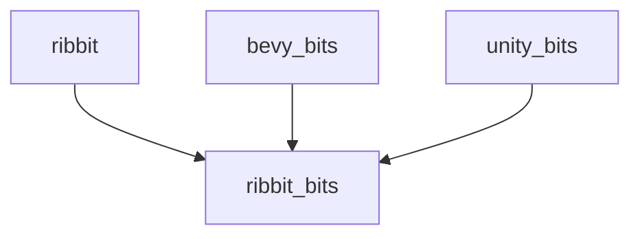

# Ribbit
Monorepo for the development of Ribbit

# Setup
- Install [Visual Studio Code](https://code.visualstudio.com/download)
- Install [Rust](https://www.rust-lang.org/tools/install)
- Install llvm-tools, by running ```rustup component add llvm-tools```
- Install Cargo Edit, by running ```cargo install cargo-edit``` (For Cargo upgrade)
- Open Visual Studio code and install all suggested extensions

# Launch your bit
In VS Code terminal, enter 

```batch
cargo run --bin your_bit
```

If you're only working on bits, you can open the bevy_bits folder in VS Code instead of the full solution and run ```cargo run --bin your_bit```. 

Opening the bevy_bits folder has the advantage of having a faster rust-analyzer.

## Launch Ribbit platform
- Run ```cargo make run-wasm```

### Tips and tricks
While you're iterating on the code, prefer running ```cargo check``` instead of ```cargo build```. It's much faster.

Always run ```cargo clippy``` before submitting, fix all the warnings discovered there.

# Documentation
- [Interactive Rust book](https://rust-book.cs.brown.edu/)
- [Bevy book](https://bevy-cheatbook.github.io/tutorial.html)

# Nomenclature
- Bit : It's a small game that has a length from a couple of seconds to 30 seconds.
- Ribbit : The platform. It controls the flow between the bits

# Architecture
At a high level, here's how the organization is structured



## Ribbit
Ribbit is the main platform (closed-source), it controls which bit is played when. It handles the frontend, backend, infrastructre the databases, assets download, remixing, features, high scores, shares, friends list, login, authentification, authorization, currency, etc.

## Bits
There's no direct dependencies between Ribbit and the bits. They communicate via messages that are known in ribbit_bits. Ribbit_bits has no knowledge of either Ribbit or the bits.

## Bevy bits
bevy_bits are bits written with the [Bevy game engine](https://bevyengine.org/).

bevy_bits_wasm is a crate that contains all the bits that depends on the bevy engine. The idea behind this crate is that by having all bits that lives inside a single wasm, the players won't have to redownload a new wasm each time they play a different bit. Even when trimming a lot, Bevy still takes 10-15Mb of space which is too much to download for a single bit.

# License
This repository is free, open source and permissively licensed. All code in this repository is dual-licensed under either:

 - MIT License (LICENSE-MIT or http://opensource.org/licenses/MIT)
 - Apache License, Version 2.0 (LICENSE-APACHE or http://www.apache.org/licenses/LICENSE-2.0)

at your option. This means you can select the license you prefer!

# Your contributions
Unless you explicitly state otherwise, any contribution intentionally submitted for inclusion in the work by you, as defined in the Apache-2.0 license, shall be dual licensed as above, without any additional terms or conditions.
